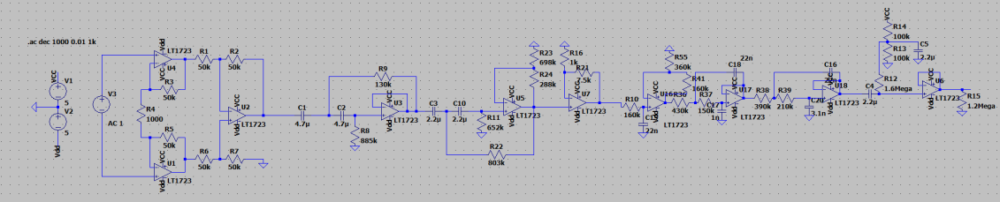
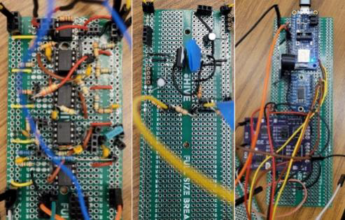
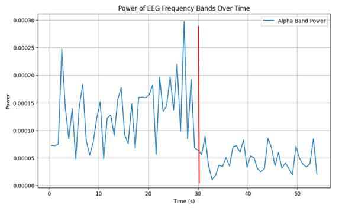
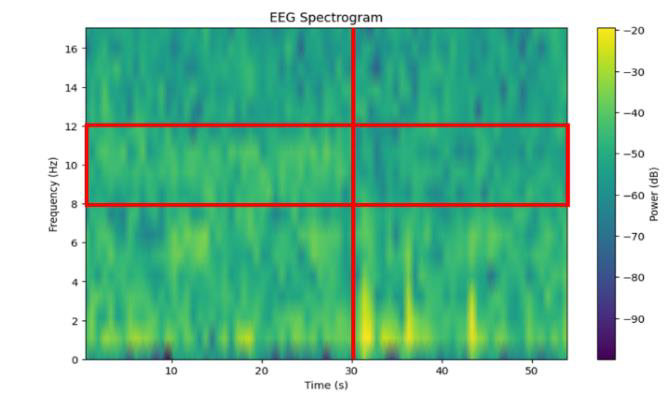
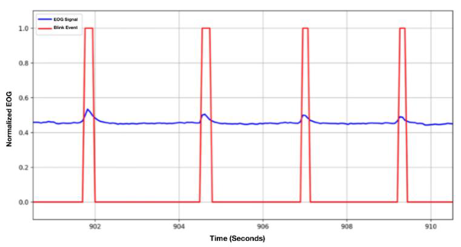

# Design Details for Wearable EEG, EOG & Accelerometry System

This project aims to detect drowsiness and distraction in drivers using a wearable system integrated into eyeglasses. Below are the details for each major part of the design along with the corresponding image.

---

## 1. Circuit Design

Our circuit design focuses on amplifying and filtering the low-amplitude EEG and EOG signals. The schematic shows how the AD623 instrumentation amplifier, Sallen-Key filters, and other conditioning circuits are connected.

  

  *Figure: Schematic of the EEG circuit design.*

---

## 2. Implementation of the EEG Circuit

The implementation phase demonstrates how the circuit was assembled and integrated onto the wearable platform. This image shows the physical layout and connections of the EEG circuitry.

  

  
  *Figure: Implementation of the EEG circuit on the wearable system.*

---

## 3. EEG Alpha Wave Analysis

To evaluate our EEG circuit, we measured the alpha wave power when the subject’s eyes were closed versus open. The first image displays the measured alpha wave power, while the second image shows the spectrogram highlighting the frequency distribution.

  

  *Figure: Analysis of alpha wave power from EEG data.*
  

  

  *Figure: Spectrogram illustrating the frequency components during the test.*
  

---

## 4. EOG Blink Detection

The EOG module captures the blink events by amplifying the bioelectric signals produced by the eyelid muscles. The designated image displays the blink detection graph, where distinct spikes correspond to individual blinks.

  

  *Figure: Graph showing blink detection events using the EOG circuit.*

  

