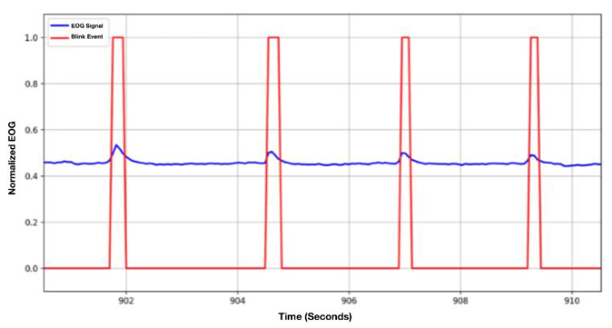

# Wearable EEG, EOG, and Accelerometry for Drowsy & Distracted Driving Detection and Warning

This repository contains the final project for ECE 4781/6781: Biomedical Instrumentation. The project is a collaborative effort among the School of Mechanical Engineering, the School of Electrical and Computer Engineering, and the School of Biomedical Engineering. Our goal is to mitigate risks associated with drowsy and distracted driving through early detection using a wearable system integrated into a pair of eyeglasses.

---

## Table of Contents

- [Executive Summary](#executive-summary)
- [Introduction & Significance](#introduction--significance)
- [System Design & Methodology](#system-design--methodology)
  - [EEG Module](#eeg-module)
  - [EOG Module](#eog-module)
  - [Accelerometer Module](#accelerometer-module)
  - [Wearable Glasses Platform](#wearable-glasses-platform)
- [Testing & Validation](#testing--validation)
- [Conclusions & Future Directions](#conclusions--future-directions)
- [Acknowledgements](#acknowledgements)
- [References](#references)

---

## Executive Summary

Drowsiness and distraction contribute significantly to fatal car crashes, resulting in over 11,000 deaths annually. Our proposed device uses a combination of physiological signals to detect early signs of driver drowsiness and distraction. By monitoring:
- **Alpha waves** Focus on alpha waves (8–12 Hz) via EEG, which increase during drowsy states and have an important role,
- **Blink rate and duration** via EOG, and
- **Head posture** via accelerometry,

the system can alert the driver in real-time. This wearable solution, integrated into eyeglasses, overcomes the impracticality of full EEG caps for everyday driving scenarios.

---

## Introduction & Significance

Motor vehicle crashes caused by drowsy and distracted driving impose a significant human and economic cost. Specifically:
- Approximately 17% of fatal crashes are linked to drowsiness.
- Distracted driving accounts for a notable fraction of injuries and fatalities.
- The overall economic toll exceeds hundreds of billions annually.

Our project leverages established physiological indicators (EEG alpha activity, blink metrics, and head tilt) to create an unobtrusive, wearable system aimed at enhancing road safety by detecting impairments before they result in accidents.

---

## System Design & Methodology

### EEG Module

- **Objective:** Amplify EEG signals in the 0.5–30 Hz range while filtering out unwanted noise.
- **Key Components:**
  - **AD623 Instrumentation Amplifier:** Configured with a gain of 100 to boost microvolt-level EEG signals.
  - **Sallen-Key High-Pass Filter:** Second-order design with a 0.1 Hz cutoff to eliminate low-frequency drift.
  - **Non-Inverting Amplifier:** Additional gain (×20) post-filtering.
  - **Low-Pass Filter:** Set with a 50 Hz cutoff to remove high-frequency noise.
  - **DC Offset Adder:** Shifts the signal into a 0–3 V range for microcontroller ADC compatibility.
- **Validation:** FFT and spectrogram analyses during controlled tests (eyes closed/open) showed clear differences in the alpha band, confirming the system’s ability to detect drowsiness-related brain activity.

### EOG Module

- **Objective:** Capture blink rate and duration to assess drowsiness.
- **Key Components:**
  - **AD623 Instrumentation Amplifier:** Amplifies weak EOG signals from muscle activity during blinking.
  - **High-Pass & Low-Pass Filters:** Isolate blink events by removing low-frequency drift and high-frequency noise.
  - **TLC2272 Op Amp:** Provides further gain and buffering to ensure a clean signal for ADC conversion.
- **Validation:** Live data displays confirmed distinct blink events, with spike width correlating to blink duration.

### Accelerometer Module

- **Objective:** Monitor head tilt to detect distraction (e.g., when looking away from the road).
- **Key Components:**
  - **Two MMA8452Q 3-Axis Accelerometers:** Mounted on either side of the glasses frame.
  - **I2C Communication:** Facilitates real-time data collection from both sensors.
  - **Software Algorithm:** Computes head tilt angle using the inverse cosine of the measured acceleration vector. If the head deviates beyond a defined threshold (indicating distraction), the system triggers an alert.
- **Validation:** Consistent detection of head tilt deviations provided effective feedback for alerting the driver.

### Wearable Glasses Platform

- **Design:** Custom 3D-printed eyeglasses adapted to house electrodes and accelerometers.
- **Challenges Addressed:**
  - Ensuring reliable skin contact for both EEG/EOG signals.
  - Maintaining user comfort during prolonged use.
- **Outcome:** The modified glasses platform successfully integrated the sensor array, demonstrating a viable form factor for wearable brain and eye monitoring.

  

---

## Testing & Validation

- **EEG Testing:** A one-minute protocol (15 seconds stabilization, 30 seconds eyes closed, 15 seconds eyes open) was used to verify the detection of alpha waves. The corresponding FFT and spectrogram analyses confirmed the presence and attenuation of the alpha band.
- **EOG & Accelerometer Testing:** Real-time data acquisition and analysis confirmed accurate blink detection and head tilt measurement, enabling timely alerts.
- **Noise Mitigation:** Despite challenges with quantization and environmental noise, our circuit design (using high-performance amplifiers) achieved a favorable signal-to-noise ratio, though future work will focus on further reducing noise artifacts.

---

## Conclusions & Future Directions

### Conclusions

- The EEG circuit reliably captures alpha wave activity, validating our electrode placement and amplification design.
- The EOG module effectively monitors blink rate and duration, serving as an indicator of drowsiness.
- Accelerometer data accurately reflects head tilt, enabling detection of distracted driving.
- Overall, the integrated wearable system demonstrates significant promise for real-world applications in driver alertness monitoring.

### Future Directions

- **Dry Electrode Optimization:** Enhance the reliability and comfort of dry electrodes to eliminate the need for wet electrodes.
- **Advanced Filtering:** Implement digital filtering techniques (e.g., moving average filters) to further reduce noise.
- **Hardware Integration:** Transition from the current ESP32 Feather platform to a more robust Arduino-based PCB design, reducing wire lengths and improving overall wearability.
- **System Calibration:** Develop dynamic calibration protocols to better adapt to individual physiological baselines.

---

## References

For detailed references, please refer to the project documentation. Key resources include studies on drowsy driving statistics, EEG/EOG signal processing, and accelerometer-based head tilt detection.

---

*This README is provided as an overview of our project. For more details, please refer to the accompanying documentation and circuit schematics.*
